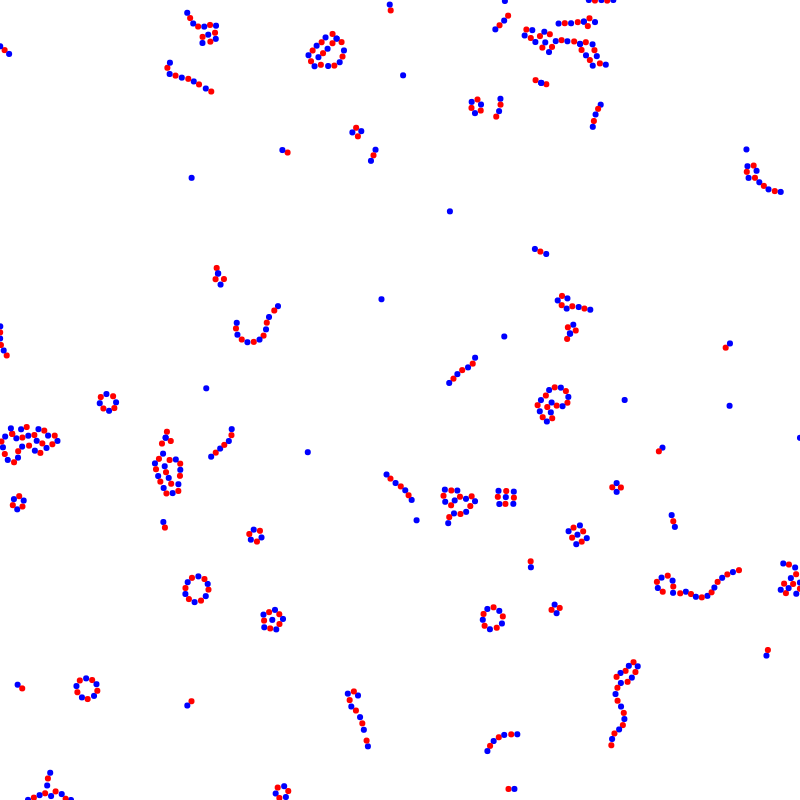
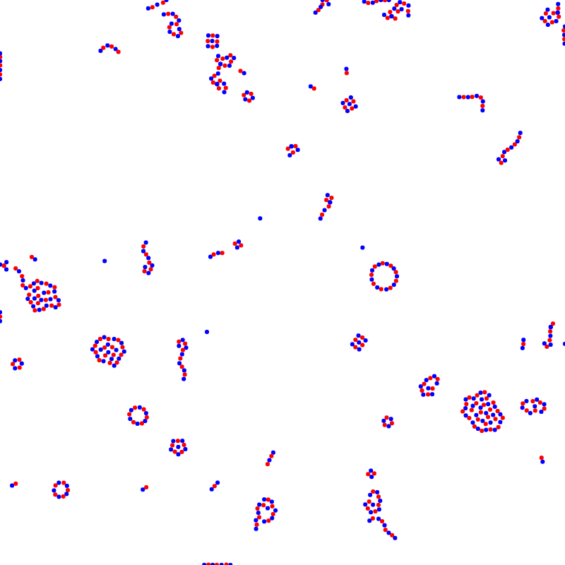

# wasm-particles

This is just a little demo project vor WebAssembly. The "simulation" imitates electromagnetic attraction and repulsion between two types of differently charged particles. Additionally, there is friction and wall collision detection.

